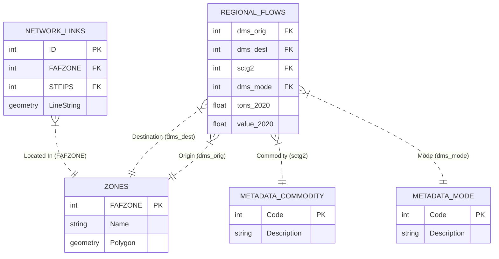

# Data Schema Documentation

This document outlines the structure of the data files used in `tidyfaf`, their columns, and the relationships between them.

## 1. Data Files

| File Name | Description | Key Columns |
| :--- | :--- | :--- |
| `FAF5.7.1.parquet` | **Regional Flows**: The core dataset containing freight flows between FAF Zones. | `dms_orig`, `dms_dest`, `sctg2`, `dms_mode`, `tons_*`, `value_*` |
| `FAF5.7.1_HiLoForecasts.parquet` | **Regional HiLo Forecasts**: Regional flows with High/Low growth scenarios. | Same as Regional + `*_high`, `*_low` |
| `FAF5.7.1_State.parquet` | **State Flows**: Aggregated freight flows between US States. | `dms_origst`, `dms_destst`, `sctg2`, `dms_mode` |
| `FAF5.7.1_State_HiLoForecasts.parquet` | **State HiLo Forecasts**: State flows with High/Low growth scenarios. | Same as State + `*_high`, `*_low` |
| `FAF5_Network_Links.parquet` | **Highway Network**: Geospatial dataset of highway links with freight attributes. | `ID`, `geometry`, `FAFZONE`, `STFIPS`, `Road_Name` |
| `FAF5_Zones_Processed.parquet` | **Zone Geometries**: Simplified polygons for FAF Zones (derived from official shapefile). | `FAFZONE`, `geometry` |
| `FAF5_metadata.xlsx` | **Metadata**: Lookup tables for codes (Commodities, Modes, Zones, States). | *Various sheets* |

## 2. Column Definitions

### Regional Flows (`FAF5.7.1.parquet`)
*   **`dms_orig`**: Origin FAF Zone Code (Foreign Key -> `FAF5_Zones_Processed.FAFZONE`)
*   **`dms_dest`**: Destination FAF Zone Code (Foreign Key -> `FAF5_Zones_Processed.FAFZONE`)
*   **`sctg2`**: Commodity Code (Standard Classification of Transported Goods, 2-digit).
*   **`dms_mode`**: Mode of Transport Code (e.g., 1=Truck, 2=Rail).
*   **`tons_{year}`**: Tonnage for the given year (e.g., `tons_2020`).
*   **`value_{year}`**: Value (in millions $) for the given year.
*   **`tmiles_{year}`**: Ton-miles for the given year.

### Network Links (`FAF5_Network_Links.parquet`)
*   **`ID`**: Unique Link ID.
*   **`geometry`**: LineString geometry of the road segment.
*   **`FAFZONE`**: FAF Zone ID where the link is located.
*   **`STFIPS`**: State FIPS Code.
*   **`Road_Name`**: Name of the road (e.g., "I-95").
*   **`AB_Flow_*` / `BA_Flow_*`**: Directional flow volumes (if available in this cut).

## 3. Relationships (Entity-Relationship Diagram)

## 4. Notes
*   **HiLo Forecasts**: The `*_HiLoForecasts.parquet` files contain the same structure as their base counterparts but include additional columns for High and Low economic growth scenarios for future years (e.g., `tons_2030_high`, `tons_2030_low`).
*   **Geometry**: `FAF5_Zones_Processed.parquet` is generated by `tidyfaf` by dissolving the official county-level shapefile based on FAF Zone IDs.

## 5. Detailed Column Reference

### Regional Flows (`FAF5.7.1.parquet`)
| Column | Type | Description |
| :--- | :--- | :--- |
| `fr_orig` | int | Foreign Origin Region Code (if applicable) |
| `dms_orig` | int | Domestic Origin FAF Zone Code |
| `dms_dest` | int | Domestic Destination FAF Zone Code |
| `fr_dest` | int | Foreign Destination Region Code (if applicable) |
| `fr_inmode` | int | Foreign Inbound Mode Code |
| `dms_mode` | int | Domestic Mode Code |
| `fr_outmode` | int | Foreign Outbound Mode Code |
| `sctg2` | int | Commodity Code (SCTG 2-digit) |
| `trade_type` | int | Trade Type (1=Domestic, 2=Import, 3=Export) |
| `dist_band` | int | Distance Band Code |
| `tons_{year}` | float | Tonnage for years: 2017-2024 (annual), 2030-2050 (5-year intervals) |
| `value_{year}` | float | Value ($M) for years: 2017-2024 (annual), 2030-2050 (5-year intervals) |
| `tmiles_{year}` | float | Ton-miles for years: 2017-2024 (annual), 2030-2050 (5-year intervals) |
| `current_value_{year}` | float | Current Value ($M) for years: 2018-2024 |

### State Flows (`FAF5.7.1_State.parquet`)
| Column | Type | Description |
| :--- | :--- | :--- |
| `dms_origst` | int | Domestic Origin State FIPS Code |
| `dms_destst` | int | Domestic Destination State FIPS Code |
| *Other columns* | - | Same as Regional Flows (`sctg2`, `dms_mode`, `tons_*`, `value_*`, etc.) |

### HiLo Forecasts (`*_HiLoForecasts.parquet`)
Includes all columns from the base Regional/State files, plus:
| Column | Type | Description |
| :--- | :--- | :--- |
| `tons_{year}_low` | float | Low Estimate Tonnage (2030-2050) |
| `tons_{year}_high` | float | High Estimate Tonnage (2030-2050) |
| `value_{year}_low` | float | Low Estimate Value (2030-2050) |
| `value_{year}_high` | float | High Estimate Value (2030-2050) |

### Network Links (`FAF5_Network_Links.parquet`)
| Column | Type | Description |
| :--- | :--- | :--- |
| `ID` | int | Unique Link Identifier |
| `LENGTH` | float | Length of the link |
| `DIR` | int | Direction |
| `DATA` | int | Data availability flag |
| `VERSION` | str | FAF Version |
| `Class` | int | Functional Class Code |
| `Class_Description` | str | Functional Class Description |
| `Road_Name` | str | Name of the road |
| `Sign_Rte` | str | Signed Route Number |
| `Rte_Type` | str | Route Type |
| `Rte_Number` | int | Route Number |
| `Rte_Qualifier` | str | Route Qualifier |
| `Country` | str | Country Code |
| `STATE` | str | State Abbreviation |
| `STFIPS` | int | State FIPS Code |
| `County_Name` | str | County Name |
| `CTFIPS` | int | County FIPS Code |
| `Urban_Code` | int | Urban Area Code |
| `FAFZONE` | int | FAF Zone ID |
| `Status` | int | Link Status |
| `F_Class` | int | Functional Class |
| `Facility_Type` | int | Facility Type |
| `NHS` | int | National Highway System Indicator |
| `STRAHNET` | int | Strategic Highway Network Indicator |
| `NHFN` | int | National Highway Freight Network Indicator |
| `Truck` | int | Truck Route Indicator |
| `AB_Lanes` | int | Number of lanes (A->B) |
| `BA_Lanes` | int | Number of lanes (B->A) |
| `Speed_Limit` | int | Speed Limit |
| `Toll_Type` | int | Toll Type |
| `Toll_Name` | str | Toll Facility Name |
| `Toll_Link` | int | Toll Link ID |
| `Toll_Link_Name` | str | Toll Link Name |
| `HPMS_USA_RouteID` | str | HPMS Route ID |
| `HPMS_Begin_Point` | float | HPMS Begin Point |
| `HPMS_End_Point` | float | HPMS End Point |
| `BorderState1` | str | Border State 1 |
| `BorderState2` | str | Border State 2 |
| `BorderFAF1` | int | Border FAF Zone 1 |
| `BorderFAF2` | int | Border FAF Zone 2 |
| `TRUCKTOLL` | int | Truck Toll Indicator |
| `BorderLink` | int | Border Link Indicator |
| `AddedBorderTime` | float | Added Border Time |
| `AdjustSpeed` | float | Speed Adjustment |
| `AdjustReason` | str | Reason for Speed Adjustment |
| `AB_FinalSpeed` | float | Final Speed (A->B) |
| `BA_FinalSpeed` | float | Final Speed (B->A) |
| `AB_CombinedSpeed` | float | Combined Speed (A->B) |
| `BA_CombinedSpeed` | float | Combined Speed (B->A) |
| `AB_FreeFlowTime` | float | Free Flow Time (A->B) |
| `BA_FreeFlowTime` | float | Free Flow Time (B->A) |
| `SHAPE_Length` | float | Shape Length |
| `geometry` | geometry | LineString geometry |

### Zones (`FAF5_Zones_Processed.parquet`)
| Column | Type | Description |
| :--- | :--- | :--- |
| `FAFZONE` | int | FAF Zone ID (Primary Key) |
| `geometry` | geometry | Polygon/MultiPolygon geometry of the zone |
